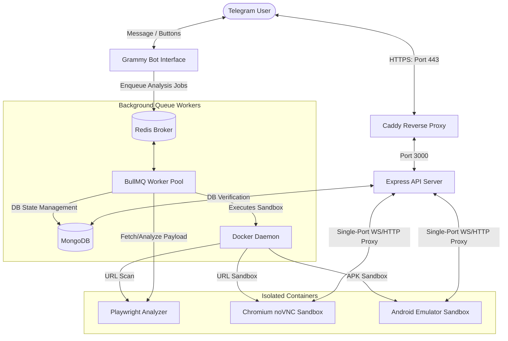
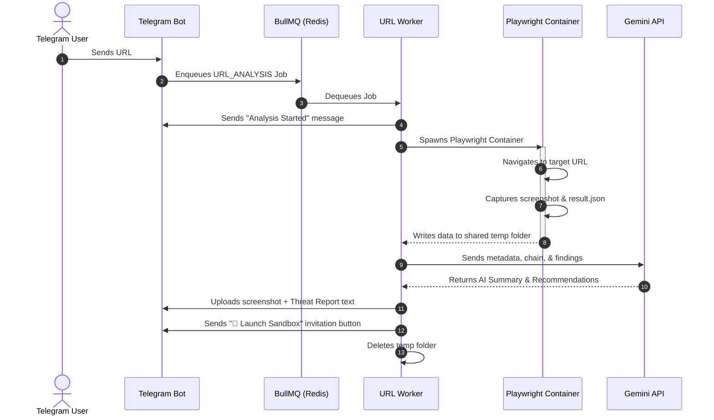
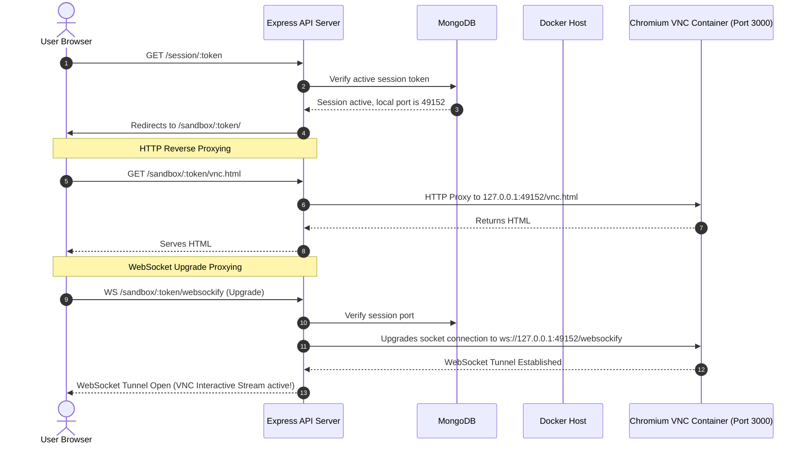
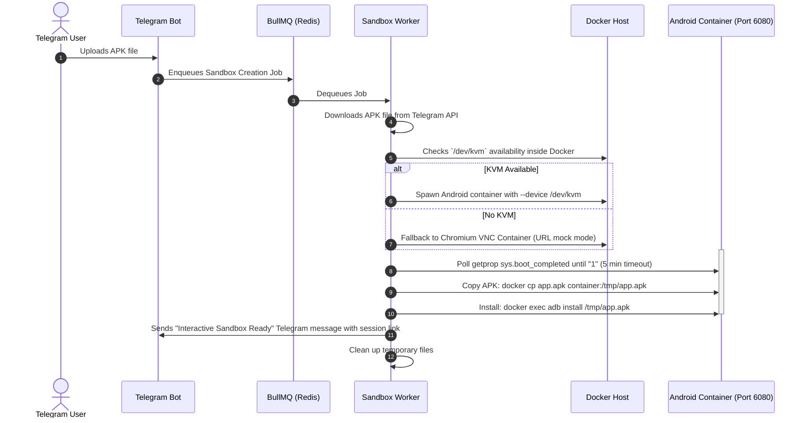

# SecureBuddy Technical Architecture & Flow Diagrams

This document outlines the system architecture, component boundaries, and core workflow diagrams of **SecureBuddy**, a Telegram-based AI Security Assistant.

---

## 1. High-Level System Architecture

SecureBuddy uses a distributed, queue-based sandbox architecture built on Node.js, Docker, MongoDB, and Redis. It isolates dangerous actions (like navigating to sketchy URLs or running untrusted APKs) inside temporary, sandboxed Docker containers.

---

## 2. Core Workflow Diagrams

### A. URL Threat Scan Flow
This flow is triggered when a user sends a website URL to the bot. It runs a headless Playwright scanner in a container, captures a screenshot, extracts findings, and summarizes the risk using Gemini.

---

### B. Interactive VNC Sandbox Flow
This flow allows users to interactively browse the URL inside a secure containerized browser, using our secure HTTP/WebSocket proxy on port 3000.

---

### C. APK Dynamic Analyzer Flow
This flow downloads an APK from Telegram, detects host KVM compatibility, starts an Android emulator container, installs the app, and opens a VNC tunnel.

